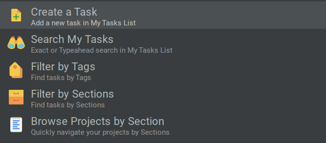

# ulauncher-asana

> Manage Asana [My Tasks](https://asana.com/guide/help/fundamentals/my-tasks) from Ulauncher.

## Screenshot



## Features

- Create a new task, including the ability to define the Section for the task.
- Search My Tasks, using [fulltext search](https://developers.asana.com/docs/search-tasks-in-a-workspace)
  or [typeahead](https://developers.asana.com/docs/typeahead).
- Filter My Tasks by Tags and Sections, once filtered you can continue typing to filter by task name.
- Navigate [favorite Projects](https://developers.asana.com/docs/get-a-users-favorites) by Section and then filtering by
  tasks.

## Requirements

- [Ulauncher 5](https://ulauncher.io)
- [Python](https://www.python.org) >= 3
- Official [Asana](https://github.com/Asana/python-asana) Python package.

You **must install** the official Asana 2.0.0 package using: `pip3 install asana==2.0.0 --user`

## Install

Open Ulauncher `Preferences` ⟶ `Extensions` ⟶ `Add extension` and paste the following url:

```
https://github.com/cacciaresi/ulauncher-asana
```

To use the extension you will need a [Personal access token](https://developers.asana.com/docs/personal-access-token)
which
can be created from [here](https://app.asana.com/0/my-apps). Set the created token in `Extensions` ⟶ `Asana`
⟶ `API Token`.

## Usage

On Ulauncher, use `a` as the default keyword to trigger the extension. By default, it will show all the available
actions, each action will have information on how to use it.

## Contributing

Contributions, issues and features requests are welcome.

## License

This project is [MIT](LICENSE) Licensed.
